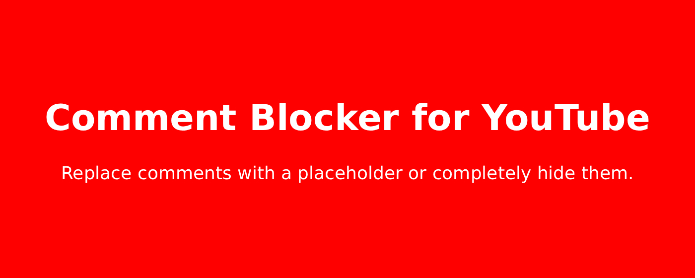
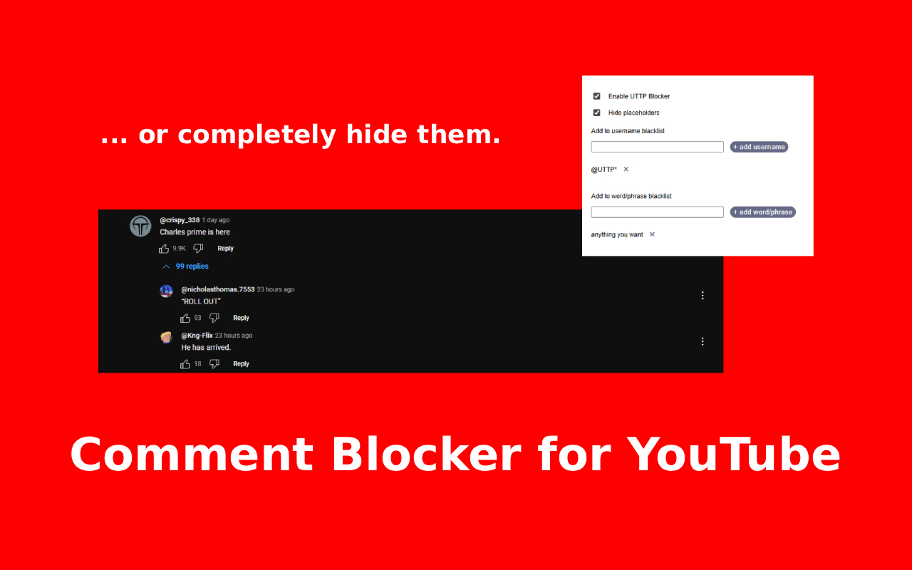

# Comment Blocker for YouTube - Chromium Extension
A simple extension to block comments on YouTube with editable blacklists for words or usernames.

If you have any issues, please open a [ticket](https://github.com/my-name-is-p/Comment-Blocker-for-YouTube/issues) or let me know on [discord](https://discord.gg/usS3kE4r)

# To try
1. [Download](https://github.com/my-name-is-p/Comment-Blocker-for-YouTube/releases/tag/v1.0.3) the zip file.
2. Unzip the file to a folder on your computer.
3. Go to chrome://extensions/
4. Enable Developer mode using the toggle. (I use edge it's in the left sidebar)
5. Click "Load unpacked" and select the folder you just unzipped.
6. The extension should now be installed and active.

# To hide placeholders
1. Open your browser’s extension menu.
2. Click on the Comment Blocker for YouTube extension.
3. In the extension popup, check the box labeled "Hide placeholders".

# To add usernames
1. Open your browser’s extension menu.
2. Click on the Comment Blocker for YouTube extension.
3. Type the username (with or without the '@') in the "Add username to blacklist" textbox.
4. Add an asterisk to the end for partial matches.
5. Press return or click the button.

# To remove usernames
1. Open your browser’s extension menu.
2. Click on the Comment Blocker for YouTube extension.
3. Click the x next to the username you want to remove.

# To add words/phrases
1. Open your browser’s extension menu.
2. Click on the Comment Blocker for YouTube extension.
3. Type the word/phrase in the "Add word/phrase to blacklist" textbox.
4. Press return or click the button.

# To remove words/phrases
1. Open your browser’s extension menu.
2. Click on the Comment Blocker for YouTube extension.
3. Click the x next to the word/phrase you want to remove.
